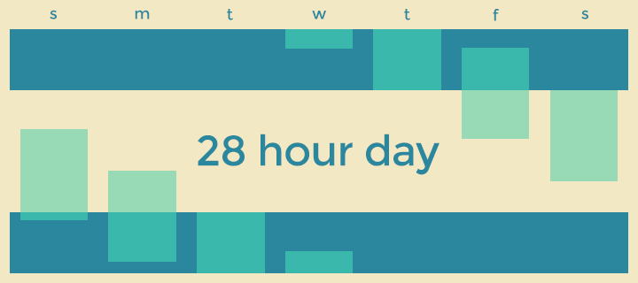

# 28 Hour Day (Pebble watchface)

Wake up early on weekdays. Stay up late on weekends. Sleep 9 hours a night and fit an extra 3 hours into each day.

This watchface divides the week into six 28-hour days instead of the standard 24/7. It works best if you have a somewhat flexible schedule, but can be tweaked to fit most lifestyles.

Feature requests are welcome :)
